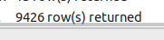

Author: [Leopard-C](https://github.com/Leopard-C)

Github: [Leopard-C/MisakaSisters](https://github.com/Leopard-C/MisakaSisters)

Email: <leopard.c@outlook.com>

Last update: 2020-04-15

---

## How many Misaka Sisters in bilibili ?

~~使用Python开发~~  

【使用C++开发】，依赖

+ JsonCpp ：解析json数据
+ libcurl：网络请求

## 1. 功能

+ 精确判断某用户名是否存在：`Validator::check(nickname, ...)`
  + 御坂1号
  + 御坂10032
  + 御坂20001号
  + misaka10032
  + ...
+ 关键词搜索：`Searcher::search(keyword, ...)`
  + 御坂
  + 御坂妹妹
  + misaka
  + 御坂号
  + yuban
  + 御板（错别字）
  + みさか（日文“御坂”）
  + ...

查找/搜索 的输入文件 在 `list/`目录下

支持扩展符：如

`御坂%d   0  20002` ： 程序运行时，将查找或匹配 `御坂0`， `御坂1`，`...` `御坂20001`

`御坂%d号   0  20002` ： 程序运行时，将查找或匹配 `御坂0号`， `御坂1号`，`...` `御坂20001号`

## 2. 使用

### 2.1 精确匹配 (check)

`./misaka_sisters check [check.list] [USE_CACHE / NO_CACHE] [proxy.list]`

无论该用户是否存在都会写入(`MySQL数据库`)数据表`MisakaSisters.misaka_sisters_info`，通过`exist`字段表示。

### 2.2 关键词搜索

`./misaka_sisters search [search.list] [proxy.list]`

搜索结果写入数据表`MisakaSisters.nicknames`

## 3. 每周自动更新

通过Linux的`crontab`，让`run.sh`每`周日`运行一次。

`run.sh`：启动若干个后台程序，进行精确匹配或搜索。所有后台程序结束后，将导出数据库内容（分别导出为`.sql`格式和`.csv`格式），然后进行打包，发布到本仓库的`release`页面下。

## 4. 结果【最后更新于2020-04-15】

+ 精确匹配了`10万`余次，查找到存在的用户`8千`余个


+ 另外，进行关键词搜索得到`4510`条记录


下面是分析后的数据

### 4.1 最`正统`的MisakaSister：[ 5314 个 ]

注：后面出现的`%d`都代表一个数字

+ 御坂%d号
+ 御坂妹妹%d号


```SQL
SELECT name AS unique_name FROM MisakaSisters.misaka_sisters_info  where name REGEXP '^御坂[0-9]+号$'
UNION
SELECT name AS unique_name FROM MisakaSisters.misaka_sisters_info  where name REGEXP '^御坂妹妹[0-9]+号$'
UNION
SELECT nickname AS unique_name FROM MisakaSisters.nicknames WHERE exist = 1 and nickname REGEXP '^御坂[0-9]+号$'
UNION
SELECT nickname AS unique_name FROM MisakaSisters.nicknames WHERE exist = 1 and nickname REGEXP '^御坂妹妹[0-9]+号$';
```

另外，有23个用户将数字`0`替换成字母`O`进行注册，很遗憾，没有将你们算入正统。


### 4.2  比较纯粹的MisakaSister  [  8824 个 ]

昵称中只有`Misaka`、`御坂`、`御坂妹妹`、`号`以及数字编号的用户。

+ Misaka%d
+ 御坂%d
+ 御坂%d号
+ 御坂妹妹%d
+ 御坂妹妹%d号


```SQL
SELECT name AS unique_name FROM MisakaSisters.misaka_sisters_info  where name REGEXP '^[mM][iI][sS][aA][kK][aA][O0-9]+$'
UNION
SELECT name AS unique_name FROM MisakaSisters.misaka_sisters_info  where name REGEXP '^御坂[O0-9]+$'
UNION
SELECT name AS unique_name FROM MisakaSisters.misaka_sisters_info  where name REGEXP '^御坂[O0-9]+号$'
UNION
SELECT name AS unique_name FROM MisakaSisters.misaka_sisters_info  where name REGEXP '^御坂妹妹[O0-9]+$'
UNION
SELECT name AS unique_name FROM MisakaSisters.misaka_sisters_info  where name REGEXP '^御坂妹妹[O0-9]+号$'
UNION
SELECT nickname AS unique_name FROM MisakaSisters.nicknames WHERE exist = 1;
```

### 4.3  较为全面(宽松)的统计  [ 9431 个 ]

也就是b站有 `9431+ `个御坂妹妹。

昵称中含有`Misaka`、`御坂`、`御坂妹妹`、`号`、数字以及其他字符的用户。

<font color="red">但是数字必须是有编号的意思，</font>如`我是御坂10032号`是符合要求的。而`御坂御坂LV6`就不符合要求。需要人工剔除（唉，我太难了）。



```SQL
SELECT name AS unique_name FROM MisakaSisters.misaka_sisters_info WHERE misaka_id <> -1
UNION
SELECT nickname AS unique_name FROM MisakaSisters.nicknames WHERE exist = 1;
```

### 4.4 编号不合法 [ 52 个 ]

+ misaka_id > 20001


```SQL
SELECT * FROM MisakaSisters.misaka_sisters_info WHERE misaka_id > 20001;
```

### 4.5 最火的MisakaSister  [ 10032 号 ]

导出数据为`csv`，使用`Excel`进一步分析

```SQL
SELECT name AS unique_name, misaka_id FROM MisakaSisters.misaka_sisters_info WHERE misaka_id <> -1
UNION
SELECT nickname AS unique_name, misaka_id FROM MisakaSisters.nicknames WHERE exist = 1
INTO OUTFILE '/var/lib/mysql-files/unique_name_misaka_id.csv' 
FIELDS TERMINATED BY ',' OPTIONALLY ENCLOSED BY '';
```

出现次数大于`5`次的`misaka_id`如下图所示。

其中前五名分别为

+ 10032
+ 20001（最后之作）
+ 10086 （很有中国特色！）
+ 19090
+ 9982


## 5. 数据(表)说明

+ `misaka_sisters_info`：基于关键词搜索得到的结果，信息较为详细，包括用户id(mid)，misaka_id，签名(sign)，头像URL(face)，粉丝数(fan)，视频数(video)，等级(level)等。
  + `misaka_id`：为`-1`说明该条记录和御坂妹妹无关。否则就代表御坂编号（经过人工筛选，99%+的可信率）
  + `exact`：为`0`表示前面的`misaka_id`是程序提取的，需要人工确认。为`1`表示较为精确(不排除极少数例外)。经过人工筛选，所有的`exact`均已经置为`1`。
+ `nicknames`：精确匹配的结果。信息简略，只能判断该用户名是否存在。
  + `nickname`：昵称（用户名）
  + `exist`：是否存在。`1`表示存在，`0`表示不存在。该字段100%可信。

数据每周日更新一次。最新的数据中，相比之前新增的数据需要人工确认。（我应该会选择性的确认部分数据）。

## 6. 趣事

+ `lever5`：单词拼错，还好无意间看到了（之前筛选过`level`，没想到后来又看到一个`lever`）

+ 给呱太编号的：`御坂美琴的呱呱太1508`，想混进御坂网络，没门。
+ 签名是一幅画


+ “御坂32001倒写”，可想而知`10032`有多抢手
+ “御坂野穹12138”，剔除。（在网上也没搜到“御坂野穹”是谁，暂且剔除吧）。
+ “御坂10032的黑猫”。剔除。
+ “爱御坂美琴的黑子1997”。你给黑子编啥号啊（也有可能是指1997年吧，出生年份，maybe）。
+ “L5の御坂”。呃呃，我查询了`Level`、`LV`，你竟然用`L5`，还好后来搜索`5`的时候找到了你，把你剔除。

## END

<leopard.c@outlook.com>